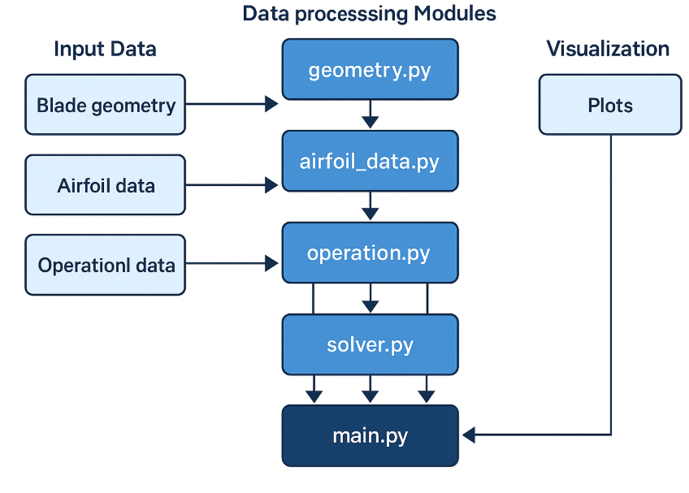

[](https://classroom.github.com/a/zjSXGKeR)
# Our Great Package

Team: Codingteam
- Rehab Salaheddin Abu Rashed   s191263
- Heba Haidar                   s184347

## Overview

This Python package implements a steady-state aerodynamic model for horizontal-axis wind turbines using **Blade Element Momentum (BEM) theory**. Developed as part of the *Scientific Programming for Wind Energy (DTU 46120)* course, the model calculates thrust, torque, and power based on turbine geometry and operational conditions.

Key features:
- Parses IEA 15MW wind turbine blade and airfoil data.
- Calculates lift and drag coefficients from airfoil polars.
- Iteratively solves for axial and tangential induction factors.
- Computes power, thrust and torque curves based on varying wind conditions.
- Computes power and thrust coefficients.
- Plots the results.


-------------------------------------------------------------------------
## Quick-start guide

This section helps you get the project up and running with minimal effort. It covers environment setup, installation, running examples, and testing.

### 1. clone the Repository

Clone the project to your local folder as followed:
1. Open your terminal git bash in the local folder
2. Type <git clone https://github.com/DTUWindEducation/final-project-codingteam.git >
3. Type: cd <your_repo_directory> 
 
### 2. create and activate a clean environment
1. Open Anaconda Prompt
2. Navigate to your project directory:
   ```bash
   cd <your_repo_directory>
3. Create a virtual environment using:
    <conda env create -f environment.yml>
4. Activate the new environment using: 
    <conda activate testpack>
 

### 3. Insatall the package

To install the package with followed dependencies:
1. numpy
2. pandas
3. matplotlib
4. scipy
 
you need to type the followed:
1. Install the package in editibal mode:
    <pip install -e .>

### 4. Run the main script
By running the main.py located in examples/, this will execute the full Blade Element Momentum (BEM) modeling process for the IEA 15 MW wind turbine. It loads all input data, runs simulations across a range of wind speeds, and generates several plots that show:
- Blade geometry and airfoil shapes.
- Operational strategy data.
- Comparison between predicted and measured turbine performance (Power and thrust curves.)
- Thrust and power coefficients in 2D plane and 3D surface.

-------------------------------------------------------------------------
## Demonstrates Required:
This project will do the following:
1. Loading and parsing turbine data (load_geometry, load_operation)
2. Plotting airfoil shapes (plot_airfoils)
3. Interpolating lift/drag (via compute_performance, which calls interpolate_polar)
4. Computing induction and tangential factors (compute_performance)
5. Computing thrust, torque, power (compute_performance)
6. Loading optimal operating strategy (load_operation)
7. Compute and plot power and thrust curves (plot_bem_vs_measured)


**Extra functions:**
1. **plot_operational_subplots(...):** Visualizing operational strategy subplots.
2. **plot_geometry(...):** Plot chord and twist.
3. **compute_cp_ct_surface(...):** Compute max values of C_p and C_t.
4. **plot_cp_ct_contours(...):** Plotting $C_P$ and $C_T$ curves as a function of lambda and pitch angle.
5. **plot_cp_ct(...):** Plotting $C_P$ and $C_T$ curves as a function of wind speed 


-------------------------------------------------------------------------
## Testing 

### 1. Test Coverage:
you need to run the test as followed in anaconda prompt:
1. <pytest --cov=src tests/>
( The test has achived the score of 95 % (16 tests have passed))
### 2. Pylint score:
You also need to run the followed to check the codes in src file using pylint as followed:
<pylint src/>
(This has acheived: 9.53/10  )

-------------------------------------------------------------------------
## Class Description:
## Implemented Classes

### `BEMSolver` (src/bem/solver.py)
This class located in 'src/bem/solver.py' performs the core Blade Element Momentum (BEM) algorithem. It iteratives the calculations for a single wind turbine case, including solving for induction and tangential factors and computing aerodynamics performance (thrust, torque and power). 

This class is designed to be flexible and modular, allowing it to:
- Load blade geometry and operational conditions.
- Iteratively solve for induction factors.
- Compute thrust, torque, and power contributions from each blade element.
- Aggregate results into global rotor performance metrics.


**Key Functions**:
- **__init__(...):** Initializes the solver with blade geometry and airfoil polar data.
- **interpolate_polar(...):** Uses linear interpolation to compute lift (Cl) and drag (Cd) coefficients for a given airfoil ID and angle of attack.
- **compute_induction_factors(...):** Calculates axial (a) and tangential (a') induction factors based on solidity and force coefficients.
- **compute_performance(...):** Main routine that loops over all blade elements to compute local forces, solves for converged a and a' values, and integrates results to output:
T: Thrust [N]
M: Torque [Nm]
P: Power [W]

-------------------------------------------------------------------------

## Architecture
The package architecture is showed in diagram.pmg



final-project/
├── inputs/                  # Turbine and airfoil data
│   └── IEA-15-240-RWT/
│       └── Airfoils/
│           ├── coord/                                # includes all shape files: `IEA-15-240-RWT_AF[xx]_Coords.txt`
│           ├── polar/                                # include all polar files: `IEA-15-240-RWT_AeroDyn15_Polar_[xx].dat`
│           ├── IEA_15MW_RWT_Onshore.opt
│           └── IEA-15-240-RWT_AeroDyn15_blade.dat    # Data on operational strategy
├── outputs/                                          # Output plots and data
├── src/
│   └── bem/                                          # Python source code
│       ├── __init__.py
│       ├── airfoil_data.py
│       ├── geometry.py
│       ├── operation.py
│       └── solver.py
├── tests/                                            # Unit tests
│   ├── test_operation.py
│   └── test_solver.py
├── examples/
│   └── main.py                                       # Execute the functions in src/bem
├── README.md
├── LICENSE
├── pyproject.toml
├── .gitignore
├── environment.yml
└── diagram.png

-------------------------------------------------------------------------
## Peer review

Our team used a peer review workflow throughout development. All major features were developed in separate branches and merged into main via pull requests (PRs). Each PR was reviewed by at least one other team member before merging to ensure code quality and consistency.

